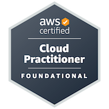
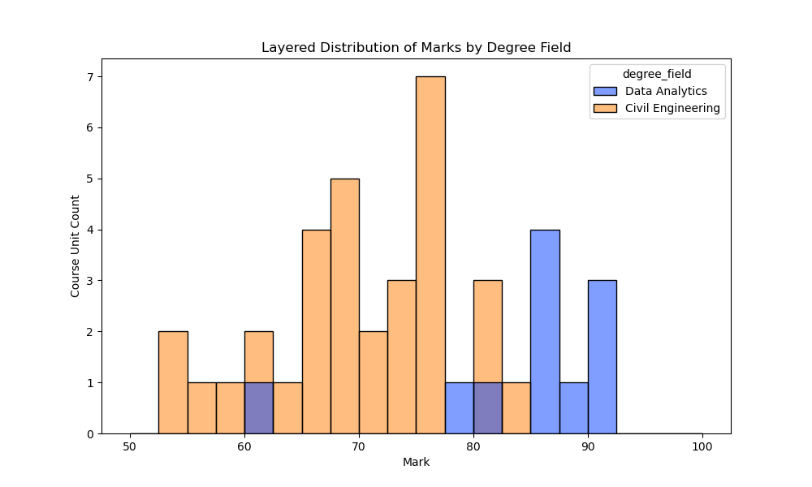

### Hi, I'm Chris 👋

I have worked as a civil engineer on telecommunications infrastructure projects for over 10 years. I have recently completed a Master of IT (Data Analytics) at Swinburne University of Technology. I am currently looking for a role in data science or data engineering. 

<!--
**rickardc/rickardc** is a ✨ _special_ ✨ repository because its `README.md` (this file) appears on your GitHub profile.

Here are some ideas to get you started:

- 🔭 I’m currently working on ...
- 🌱 I’m currently learning ...
- 👯 I’m looking to collaborate on ...
- 🤔 I’m looking for help with ...
- 💬 Ask me about ...
- 📫 How to reach me: ...
- 😄 Pronouns: ...
- ⚡ Fun fact: ...
-->

## Technical Certifications

These are some of my Cloud Certifications.

<table>
    <tr>
        <td>
            <a href="https://www.credly.com/badges/b7232518-e858-4961-81fc-32be8077ccb9/public_url" >AWS Certified Cloud Practitioner</a>
        </td>
    </tr>
    <tr>
        <td style="text-align:center">
            
        </td>
    </tr>

</table>

<!--
|[**AWS Certified Cloud Practitioner**](https://www.credly.com/badges/b7232518-e858-4961-81fc-32be8077ccb9/public_url)|
|:---:|
||
-->

## Education

Master of IT (Data Analytics)
Swinbunre University of Technology

Bachelor of Engineering (Civil)
Swineburne University of Technology

#### Visualisation of Marks

