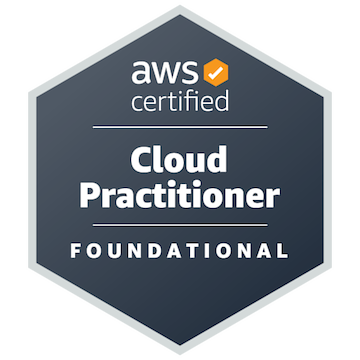
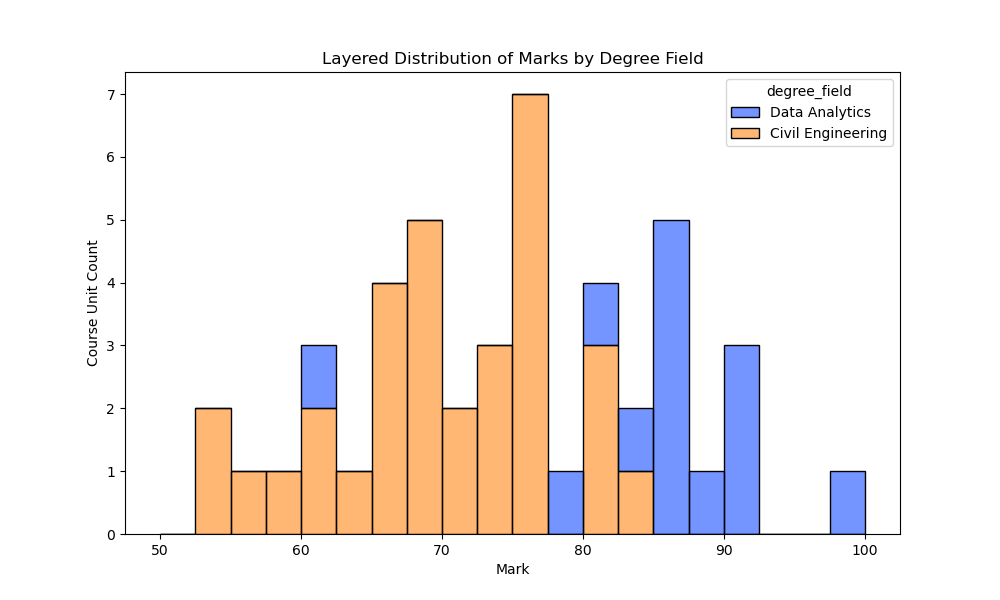

### Hi, I'm Chris 👋

I have worked as a civil engineer on telecommunications infrastructure projects for over 10 years. I am currently in a career transition completing Masters of IT (Data Analytics) at Swinburne University of Technology. Also currently looking for a role in data science or data engineering. Using github to display some of my university projects and other personal projects.

<!--
**rickardc/rickardc** is a ✨ _special_ ✨ repository because its `README.md` (this file) appears on your GitHub profile.

Here are some ideas to get you started:

- 🔭 I’m currently working on ...
- 🌱 I’m currently learning ...
- 👯 I’m looking to collaborate on ...
- 🤔 I’m looking for help with ...
- 💬 Ask me about ...
- 📫 How to reach me: ...
- 😄 Pronouns: ...
- ⚡ Fun fact: ...
-->

<!--

## Skills

- structured problem solving
- priority management
- 

- data analysis
- data visualisation
- machine learning
- cloud computing
- data engineering

### University Projects

- Computer Vision
- Image Classification (without deep learning)
- User Centred Design
- Data Visualisation
- Suburb Search

## Work Experience

- Project Engineer
- Structural Engineer

-->

## Technical Certifications

These are some of my cloud certifications.

<table>
    <tr>
        <th>
            <a href="https://www.credly.com/badges/3def8363-f85c-48dc-b832-563a7cc01a4e/public_url" target=_blank>
                AWS   Solutions Architect
            </a>
        </th>
        <th>
            <a href="https://learn.microsoft.com/api/credentials/share/en-us/Chris-9030/F321A271495D4AB7?sharingId=16E153E7851D7C36">
            Microsoft   AI-900
            </a>
        </th>
        <th>
            <a href="https://catalog-education.oracle.com/pls/certview/sharebadge?id=56D96A8F3C7446F7F5441A7DB642CC57DB4994D2FAAA9723FBB500D3BBAFC6C3" target=_blank> 
            OCI   Foundations Associate
            </a>
        </th>
    </tr>
    <tr>
        <td style="text-align:center">
            
        </td>
        <td style="text-align:center">
            
        </td>
        <td style="text-align:center">
            
        </td>
    </tr>
    <tr>
        <th>
            <a href="https://www.credly.com/badges/b7232518-e858-4961-81fc-32be8077ccb9/public_url" target=_blank>
            AWS   Cloud Practitioner
            </a>
        </th>
    </tr>
    <tr>
        <td style="text-align:center">
            
        </td>
    </tr>

</table>

## Education

<b>Master of IT (Data Analytics)</b>
 
Swinburne University of Technology

<b>Bachelor of Engineering (Civil)</b>
 
Swinburne University of Technology

#### Visualisation of Mark Distribution

